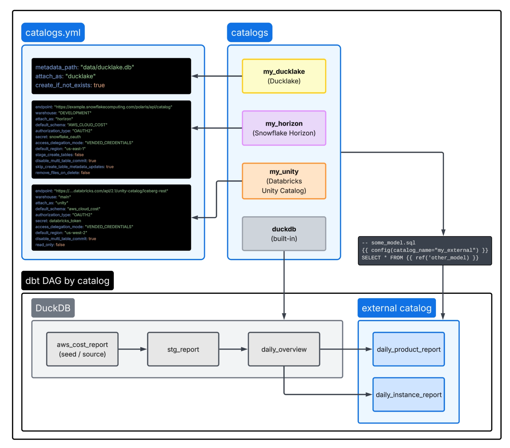

# dbt multi-catalog demo (AWS cloud cost on DuckDB)

A simple dbt project using dbt Core v2 and DuckDB to demonstrate the power of dbt's catalogs v2 spec.

Models can arbitrarily be written to different external Iceberg REST catalogs.

The source data is a mocked version of AWS's Cost & Usage Report pipeline.

The models are adapted from Fivetran's
[`dbt_aws_cloud_cost`](https://github.com/fivetran/dbt_aws_cloud_cost) package;
this repo repurposes them to demonstrate catalogs v2.

The default path (`ducklake`) runs with **zero credentials**.

> Throughout, "dbt" means the dbt Fusion (dbt Core v2) `dbt` CLI —
> see [Install dbt](#install-dbt)

## How it works

Each model picks its output catalog with `+catalog_name`, which dbt resolves to a
block in `catalogs.yml`. Staging stays in the built-in DuckDB catalog; final models
can fan out to external catalogs (DuckLake / Horizon / Unity / …). The pipeline at a
glance:



- The **source** is a committed seed (`seeds/aws_cost_report.csv`), loaded by
  `dbt seed`. No external source catalog to attach, so the demo runs offline.
- The models build into the **output catalog** named by `+catalog_name` in
  `dbt_project.yml`. Switching catalogs = pick a different `+catalog_name` and
  uncomment the matching block in `catalogs.yml` (see
  [Switching catalogs](#switching-catalogs)).

### Output catalogs

| Catalog | Type | Status | Needs |
| --- | --- | --- | --- |
| `ducklake` | DuckLake (local metadata) | ✅ default | nothing |
| `lakekeeper` | Iceberg REST (local) | ✅ | `docker compose up -d` |
| `horizon` | Snowflake Horizon (Polaris REST) | ✅ | Snowflake creds (`SNOWFLAKE_*`) |
| `mdls` | Iceberg REST (Polaris) | ✅ | Polaris creds (`POLARIS_*`) |
| `unity` | Databricks Unity Catalog | ✅ | Databricks creds (`DATABRICKS_*`) |
| `s3_tables` | Amazon S3 Tables | 🧪 driver-only (Fusion adapter support pending) | AWS creds |

`horizon` and `unity` writes need the write-compat attach options from
[duckdb/duckdb-iceberg#1017](https://github.com/duckdb/duckdb-iceberg/pull/1017)
(**shipped in DuckDB 1.5.4**) — the official DuckDB driver fetched from the dbt
CDN includes them, and the `catalogs.yml` blocks set `read_only: false`
(+ `disable_multi_table_commit`).
`horizon` additionally requires **key-pair auth** (a PAT can read but not write)
and an **uppercase** target schema (`CATALOG_SCHEMA=AWS_CLOUD_COST`) — see
[External-catalog credentials](#external-catalog-credentials). Unity here is
**proprietary Databricks** Unity Catalog; OSS `unitycatalog/unitycatalog` is a
separate target tracked in
[#2](https://github.com/dataders/dbt_aws_cloud_cost/issues/2).

### dbt-compute (Alt engine) feature support

This branch also demonstrates Fivetran's internal, staging-only dbt-compute
service (an "Alt engine" `type: alt` dbt adapter). There's no public
documentation for it, so the table below is sourced directly from the
`fs`/`quack` codebases. It describes the `+alt_compute: alt` **routing** path
(specific models opting onto the Alt engine while the rest of the DAG runs
elsewhere) — see the [Mixed-compute demo](#mixed-compute-demo-snowflake---alt---snowflake)
section below for how this branch uses it. The sibling `alt-compute-only`
branch uses a different, less-supported mechanism (a bare `type: alt` default
target, no routing) that none of these rows describe — see that branch's
README for its own findings.

| Feature | Alt engine (`alt_compute: alt` routing) support |
| --- | --- |
| Materializations | `table`, `view`, `incremental` only |
| Incremental strategies | `append`, `insert_overwrite` only — `merge`/`delete+insert`/`microbatch`/`replace_where` explicitly rejected at runtime |
| Custom materializations | Pass parse-time validation, **always fail at runtime** — a real gap between the two layers |
| Seeds | Not routable (no `+alt_compute` config field on seeds at all) |
| Snapshots | Rejected at parse time |
| Python models | Rejected at parse time (`alt_compute: 'alt' does not support Python models in v1`) |
| Grants / contracts / constraints / persist_docs | Config accepted; the execution path bypasses macro dispatch entirely and never references them — moderate-confidence silent no-op, not an error |
| Write-target catalog types | `iceberg_rest`, `horizon` only — `glue`/`unity`/`ducklake` hit a hard `unimplemented!()` panic |
| Mixed-compute DAGs | Supported via a resolver rule: any `alt_compute: alt` model's upstreams must each be catalog-attached (`catalog_name` set, `table_format: iceberg`, or themselves `alt_compute: alt`) — otherwise a hard parse error |
| Driver distribution | No CDN release yet — requires a locally-built `adbc_driver_dbt` |

Full investigation, including file:line citations into the `fs`/`quack`
source: `docs/superpowers/specs/2026-08-04-mdls-dbt-compute-scenarios-design.md`.

## Mixed-compute demo: Snowflake -> Alt -> Snowflake

A 3-stage DAG that hands off compute engines twice, all against the same MDLS
destination via the catalog-linked database (CLD):

```
stg_report (Snowflake, catalog_name=mdls)
  -> daily_overview (alt_compute=alt, catalog_name=mdls)   [writes to Polaris/MDLS directly]
      -> daily_instance_report, daily_product_report (Snowflake, catalog_name=mdls)  [read back via CLD]
```

Required env vars: the `SNOWFLAKE_*` and `DBT_COMPUTE_*` sections of
`.env.example`. Prerequisites: an fs-built `dbt` binary (the published CDN
CLI doesn't support `type: alt` yet) and a locally-built `adbc_driver_dbt`
(`quack/scripts/build-adbc-driver-local.sh`), pointed at via
`ADBC_REPOSITORY` + `DISABLE_AUTO_DRIVER_REBUILD=true`.

**Verified status, run for real against the staging service:**

- `stg_report` (Snowflake) builds correctly.
- `daily_overview` (Alt engine write) needed one real fix: the Alt write path
  creates Iceberg **v2** tables regardless of a model's `iceberg_version='3'`
  config — that config simply doesn't propagate through the Alt engine's
  write path. v2 caps timestamp precision at microseconds, and
  `billing_period_start_date`/`billing_period_end_date` arrive as
  nanosecond-precision timestamps, so the model now casts them to `date` (the
  same treatment `usage_start_date`/`usage_end_date` already got) instead of
  relying on `iceberg_version` to fix it.
- With that fixed, `daily_overview`'s table creation itself succeeds, but the
  **write-visibility credential propagation step back to Snowflake currently
  fails** (confirmed twice, including a `--full-refresh` retry — not a
  transient blip): `Propagation failed for ... Network policy is required` —
  the Snowflake account's network policy is rejecting connections from
  wherever the dbt-compute staging service runs. This is a Snowflake account
  security setting, not a bug in this repo's config, and not something to fix
  by editing project files: whoever administers the `snowflake_demo`
  account's (`oeqikbr-bj94303`) network policy needs to allowlist the
  dbt-compute staging service's egress IP(s), or loosen the policy, before
  `daily_instance_report`/`daily_product_report` can read `daily_overview`'s
  rows back through the CLD. **This is the one remaining blocker on this
  branch** — everything else in the DAG is verified working.
- To isolate whether the *downstream read* half of this scenario (Snowflake
  reading `daily_overview`'s rows back through the CLD) works independently
  of the Alt-engine propagation blocker, `daily_overview` was temporarily
  built **natively on Snowflake** instead (dropping `alt_compute='alt'` from
  its config, table pre-dropped since Iceberg CLD tables don't support
  `CREATE OR REPLACE`) and the full DAG re-run. Result: **all 4 models
  succeeded**, with real data —
  `daily_instance_report` has 144 rows, `daily_product_report` has 576 —
  proving the `catalog_name`-driven CLD read path itself is correct. The
  *only* broken piece of this scenario is specifically the Alt engine's
  write-visibility credential-propagation step; everything else (the DAG
  shape, the timestamp fix, the CLD read mechanism) is proven working. This
  was a temporary diagnostic change, reverted immediately after — the
  committed model still uses `alt_compute='alt'` as designed.

## Quick start

The default `ducklake` path needs **no credentials**.

### Prerequisites

- macOS or Linux
- The dbt Fusion CLI (see [Install dbt](#install-dbt))
- `docker` — only for the `lakekeeper` catalog
- [`uv`](https://docs.astral.sh/uv/) — only for the optional Snowflake helper
  scripts (`scripts/*.sh`)
- Credentials only for whichever external catalog you want to exercise. The
  default `ducklake` path needs none.

### Steps

1. **Install dbt** — see [Install dbt](#install-dbt). Nothing to compile: the
   DuckDB driver is the official DuckDB 1.5.4 release, fetched from the dbt CDN
   on first run.
2. **Write `.env`**:
   ```bash
   scripts/setup.sh
   source .env                            # or: set -a && source .env && set +a
   ```
3. **Run the demo** (builds into the zero-credential `ducklake` catalog):
   ```bash
   dbt seed                               # load the committed seed
   dbt run                                # build the models into ducklake
   ```
4. **Inspect the output** — see [Setup and run](#setup-and-run).
5. **(optional) Try another catalog** — pick one of `lakekeeper` / `horizon` /
   `mdls` / `unity`, one at a time, per
   [Switching catalogs](#switching-catalogs). Verified writing: ducklake,
   lakekeeper, mdls (Polaris), horizon (Snowflake), unity (Databricks).

## Install dbt

Catalogs v2 read-write ships in the published dbt Fusion CLI, so there is
nothing to build:

```bash
curl -fsSL https://public.cdn.getdbt.com/fs/install/install.sh | sh -s -- --update
dbt --version          # verified on dbt-fusion 2.0.0-preview.193
dbt system update      # later, to move to the newest release
```

`catalogs.yml` v2 is still experimental — `dbt` prints a schema-validation
warning on every invocation and the spec can change (dbt-core
[#12723](https://github.com/dbt-labs/dbt-core/discussions/12723)). The project
opts in with `use_catalogs_v2: true` in `dbt_project.yml`.

The DuckDB driver is the **official DuckDB 1.5.4 release**, fetched
automatically from the dbt CDN on first run. The write-compat attach options the
v2 Horizon/Unity catalogs need (duckdb-iceberg
[#1017](https://github.com/duckdb/duckdb-iceberg/pull/1017) /
[#1018](https://github.com/duckdb/duckdb-iceberg/pull/1018) /
[#1020](https://github.com/duckdb/duckdb-iceberg/pull/1020)) **shipped in DuckDB
1.5.4**, so that driver carries them. dbt downloads the signed `httpfs`,
`iceberg`, and `ducklake` extensions from the official extension repository on
first use (`autoinstall_known_extensions` / `autoload_known_extensions` are
enabled in `profiles.yml`).

## Setup and run

From the repo root:

```bash
scripts/setup.sh

set -a && source .env && set +a        # load it (or: direnv allow)

dbt seed                               # load the committed seed (built-in catalog)
dbt run                                # build the models into the ducklake catalog
```

`setup.sh` checks that `dbt` is on your `PATH` and writes a credential-free
`.env` (it won't overwrite an existing one). Prefer to do it by hand? Copy
`.env.example` to `.env` — `setup.sh` is just a convenience.

Inspect the result (any DuckLake-1.0-capable DuckDB CLI — e.g. `brew install duckdb`):

```bash
duckdb :memory: -c \
  "ATTACH 'ducklake:./data/ducklake.db' AS dl;
   SELECT * FROM dl.aws_cloud_cost.daily_overview LIMIT 5;"
```

## Switching catalogs

The active catalog is pinned in two places that **must agree**: `+catalog_name`
in `dbt_project.yml`, and the single uncommented block in `catalogs.yml` (Fusion
attaches every catalog in that file, so exactly one stays active). To switch,
e.g. to `lakekeeper`:

1. In `catalogs.yml`: comment the current block and uncomment the `lakekeeper`
   one (strip the leading `# ` from each line).
2. In `dbt_project.yml`: set `+catalog_name: lakekeeper`.
3. For a credentialed catalog only: also uncomment its secret block in
   `profiles.yml` and supply its env vars (see below), then re-`source .env`.
4. `dbt run`.

`uv run tests/test_demo_configuration.py` enforces the one-active-catalog
== `+catalog_name` invariant.

## External-catalog credentials

For any non-default catalog, copy the matching section from `.env.example` into
`.env`, fill it in, then uncomment that catalog's block in `catalogs.yml` and its
secret block in `profiles.yml`. `.env` is git-ignored — never commit it.

Prefer to keep credentials out of the repo entirely? `.envrc` first calls
`source_dotfiles_env dbt-aws-cloud-cost` when your `~/.config/direnv/direnvrc`
defines that helper, so the vars can come from a private overlay outside the
repo:

```bash
# ~/.config/direnv/direnvrc
source_dotfiles_env() {
  source_env_if_exists "$HOME/my-private-env/projects/${1:-$(basename "$PWD")}.envrc"
}
```

Without the helper the call is a no-op. `.env` loads afterwards either way, so
repo-local settings (and the session `HORIZON_ACCESS_TOKEN`) still win.

The tables below list the permissions the catalog's principal needs to **write**
from an external engine (reads need a subset). Privilege names follow each
provider's own docs — treat them as the minimum to get the demo writing, not an
exhaustive security policy.

### lakekeeper (local — no credentials)

`docker compose up -d` (lakekeeper + minio + postgres), then run; teardown with
`docker compose down -v`. No cloud permissions: the warehouse attaches with
`AUTHORIZATION_TYPE NONE` and the static minio keys baked into `profiles.yml`.

The warehouse advertises its storage endpoint as `http://minio:9000` (set by the
`initialwarehouse` service). For that hostname to resolve from your host — needed
by both dbt and the Lakekeeper UI's in-browser data preview — add this one-time
entry to `/etc/hosts`:

```
127.0.0.1 minio
```

`docker-compose.yml` publishes minio on port `9000` (matching the advertised
endpoint) and sets `MINIO_API_CORS_ALLOW_ORIGIN=http://localhost:18181` so the
browser preview can read Iceberg metadata directly from object storage.

### horizon (Snowflake)

Set the `SNOWFLAKE_*` key-pair vars, then:

```bash
scripts/configure_horizon_schema.sh  # one-time: catalog-linked schema + writable external volume
scripts/refresh_horizon_token.sh     # mints a KEY-PAIR access token -> HORIZON_ACCESS_TOKEN (~55 min)
scripts/doctor.sh                    # checks SQL-API + Horizon connectivity
```

| Object | Privilege / setting | Why |
| --- | --- | --- |
| user | **key-pair (RSA) auth** | a PAT can *read* but `createTable` 403s on write |
| schema | `CATALOG = 'SNOWFLAKE'` (catalog-linked) + `CREATE ICEBERG TABLE` | models create Iceberg tables here |
| schema name | **UPPERCASE** (`AWS_CLOUD_COST`) | the REST namespace is case-sensitive on write |
| external volume | `ALLOW_WRITES = TRUE` + `USAGE` granted to the role | the external engine writes data files here — not `SNOWFLAKE_MANAGED` (its internal storage can't be written externally) |
| warehouse + database | `USAGE` | resolve and run |
| region | `SNOWFLAKE_DEFAULT_REGION` = the volume's region (`us-east-1`) | must match the external volume |

Keep `+schema: aws_cloud_cost` so the `generate_schema_name` macro substitutes
the uppercase `CATALOG_SCHEMA`. Re-run `refresh_horizon_token.sh` when the token
expires.

### mdls (Iceberg REST — Polaris)

Set the `POLARIS_*` vars. The principal's catalog role needs namespace + table
write privileges:

| Privilege | Scope |
| --- | --- |
| `TABLE_CREATE`, `TABLE_WRITE_DATA` | catalog / namespace |
| `NAMESPACE_CREATE` | catalog |
| `PRINCIPAL_ROLE:ALL` (or a role granting the above) | principal |

### unity (Databricks)

Set `DATABRICKS_*`; reads **and writes** work. The token's principal needs, on the
target catalog and schema:

| Object | Privilege |
| --- | --- |
| catalog | `USE CATALOG` |
| schema | `USE SCHEMA`, `CREATE TABLE` |
| schema | `EXTERNAL USE SCHEMA` (required for external Iceberg-REST clients) |

The `catalogs.yml` block also sets `read_only: false` + `disable_multi_table_commit`
(without them `createTable` 403s — which is what made it look read-only).
Databricks UC accepts either schema case. (OSS Unity Catalog is a separate
target — see [#2](https://github.com/dataders/dbt_aws_cloud_cost/issues/2).)

### s3_tables (Amazon S3 Tables — experimental)

Set `AWS_S3_TABLES_*`; auth uses the standard AWS credential chain (configure your
AWS SSO/profile). **The Fusion adapter does not accept `type: s3_tables` yet**
(support pending) — the driver already works
(`ATTACH '<bucket-arn>' (TYPE iceberg, ENDPOINT_TYPE 's3_tables')`), and writes
benchmark as the fastest of the remote catalogs (~1.8s/table, vs Unity ~5.5s,
Horizon ~12s). The IAM principal needs:

| Action (or managed policy) | Scope |
| --- | --- |
| `AmazonS3TablesFullAccess` (managed) — or the granular actions below | table bucket |
| `s3tables:CreateNamespace`, `CreateTable`, `GetTable`, `GetTableMetadataLocation`, `UpdateTableMetadataLocation` | table bucket |
| `s3tables:GetTableData`, `PutTableData` | table data |

A table bucket + namespace must already exist
(`aws s3tables create-table-bucket` / `create-namespace`). Note: live AWS creds
and the local `lakekeeper` (minio) target can't be active in the same run.

## Regenerating the seed

The seed is committed (`seeds/aws_cost_report.csv`), so you normally never touch
it. The ShadowTraffic generator that originally produced it has been removed from
this repo; reintroduce a generator separately if you need fresh data.

## Diagnostics

- `scripts/doctor.sh` — checks SQL-API auth + Horizon catalog connectivity.

## Troubleshooting

- **extension load / autoload errors on a run** — the official driver fetches
  `httpfs` / `iceberg` / `ducklake` from the extension repository on first use,
  so the first run needs network access. Confirm `autoinstall_known_extensions`
  and `autoload_known_extensions` are `true` in `profiles.yml` (the default).
- **Horizon / Unity writes fail (`Unhandled options` / `createTable` errors)** —
  these catalogs need the write-compat ATTACH options from duckdb-iceberg #1017,
  which require **DuckDB 1.5.4**. dbt ships the official 1.5.4 driver on its CDN,
  but if a DuckDB ≥1.5.4 is installed on your system the loader uses that
  instead — so an older system DuckDB (e.g. Homebrew 1.5.3) will be missing
  #1017. Upgrade your system DuckDB to ≥1.5.4 (the credential-free `ducklake`
  path works on 1.5.3 too). Reads aren't affected.
- **catalog name mismatch** — `+catalog_name` in `dbt_project.yml` must equal the
  single uncommented catalog in `catalogs.yml` (the pytest invariant checks this).
- **OAuth errors on a local run** — you uncommented a secret block in
  `profiles.yml` without supplying its credentials; re-comment it (the default
  `ducklake` path needs none).
- **lakekeeper hangs / can't attach** — confirm `docker compose up -d` is healthy
  at `http://localhost:18181`.
- **Lakekeeper UI "Failed to load preview / CORS Error"** — the in-browser
  preview reads object storage at the advertised endpoint `http://minio:9000`.
  Three things must agree: (1) `127.0.0.1 minio` in `/etc/hosts`, (2) minio
  published on host port `9000` (`docker-compose.yml`), and (3)
  `MINIO_API_CORS_ALLOW_ORIGIN=http://localhost:18181` on the minio service. If
  you changed any, recreate with `docker compose up -d --force-recreate minio`
  and hard-refresh the tab. A connection failure to `minio:9000` surfaces in the
  UI as a generic "CORS Error", so check reachability first.
- **Unity writes fail (`403`)** — the unity `catalogs.yml` block is missing
  `read_only: false` / `disable_multi_table_commit: true`. Unity writes *do* work
  with both set; without them `createTable` 403s (which originally looked like
  read-only).
